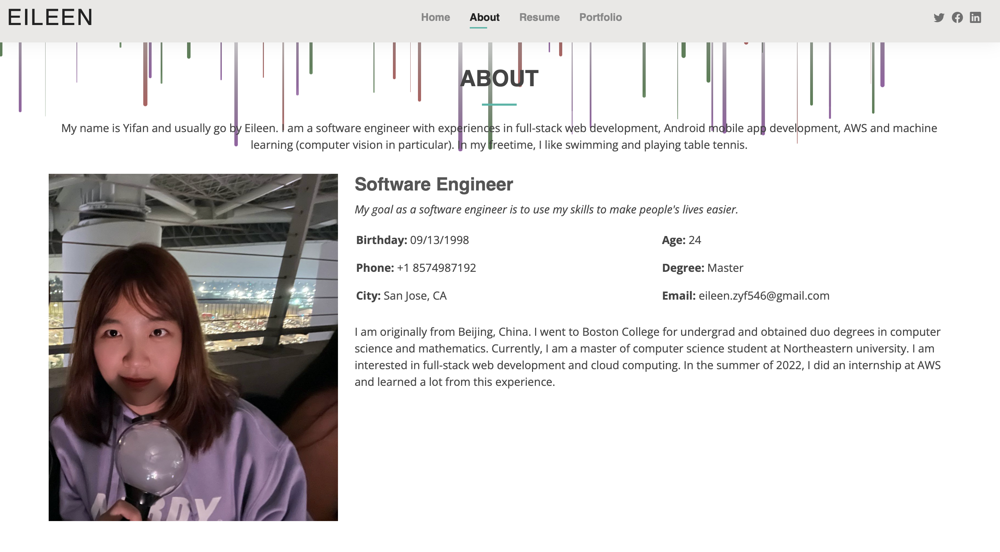
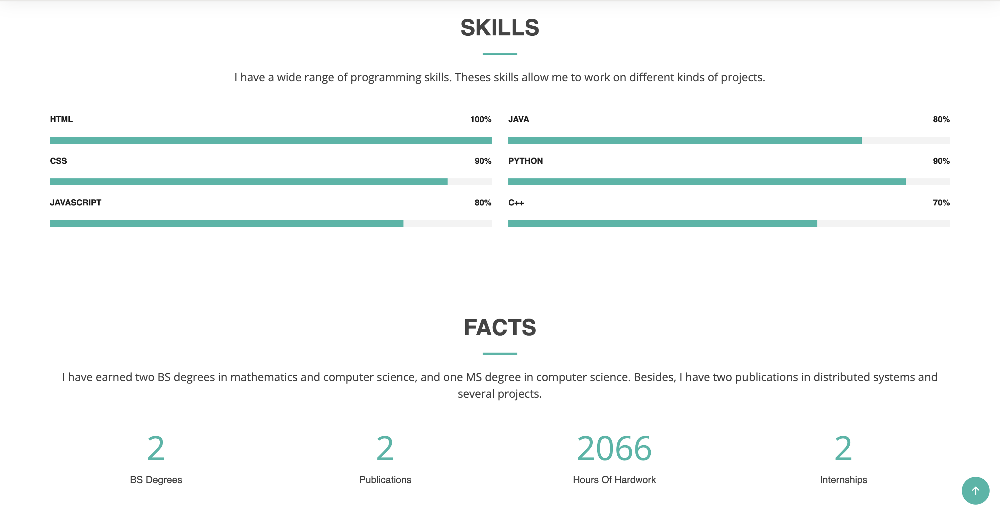
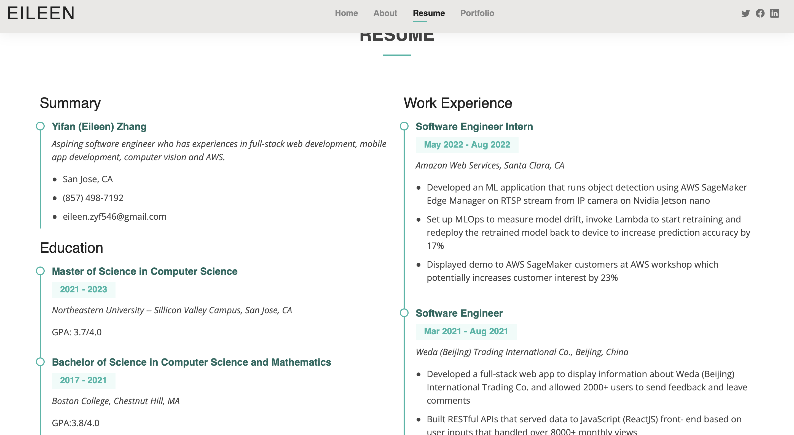
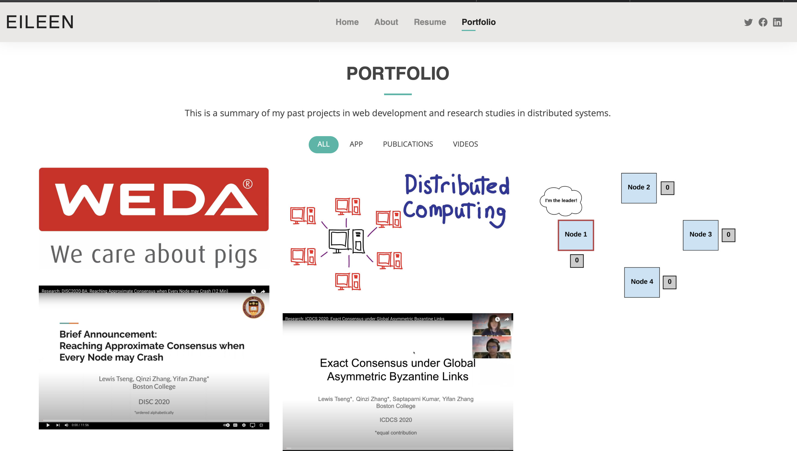
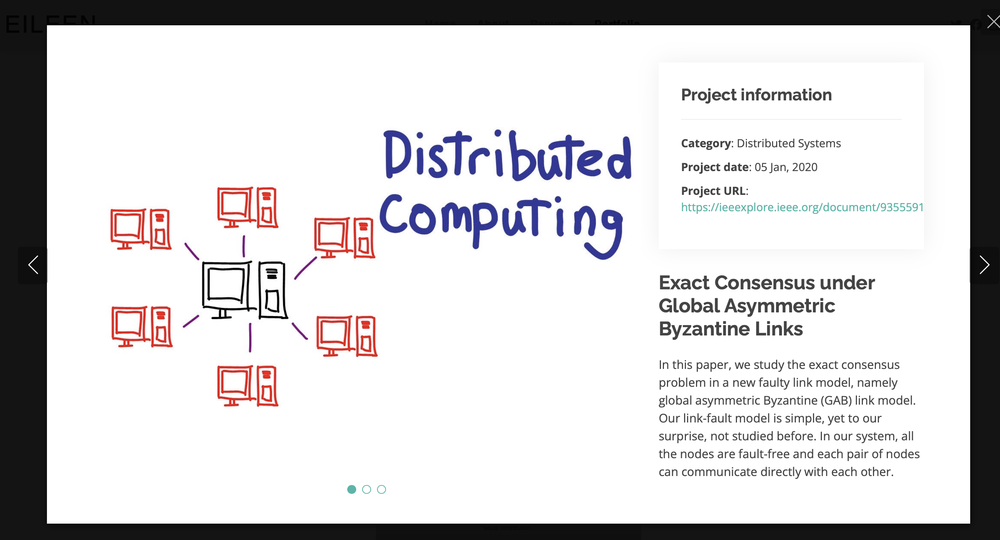

# Yifan (Eileen) Zhang Homepage

## Project Description
This project is a homepage to display my work experiences and skills. I used Bootstrap templates for the main structure, and developed a JavaScript component to improve UI/UX. On the main page (index.html), the user can see a picture of me with a single line of self-introduction. Then, the user can navigate to see my ‘about’ page for more details, my resume and my portfolio page to take a closer look at my experiences.

[Class Link](https://johnguerra.co/lectures/webDevelopment_fall2022/).

## Home Page
This page shows a background image of myself and one line of self-introduction. The user can click on about button to navigate to about page.

## About Page
This page has an rainfall effect on the top, which is implemented using vanilla JS. Besides, the user can see detailed information about my past experiences on this page.

## Resume Page
This page simply shows my resume so that the user can look at it directly.

## Portfolio Page
This page is scattered with my past projects. When the user click on the project component, a new page with more project details will pop up and the user can navigate to other project detail pages. 

## How To Build
Simply clone the repo and either open index.html in your browser or run at your local server.
